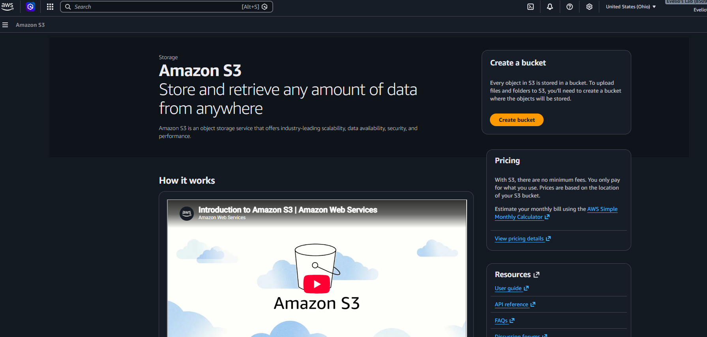
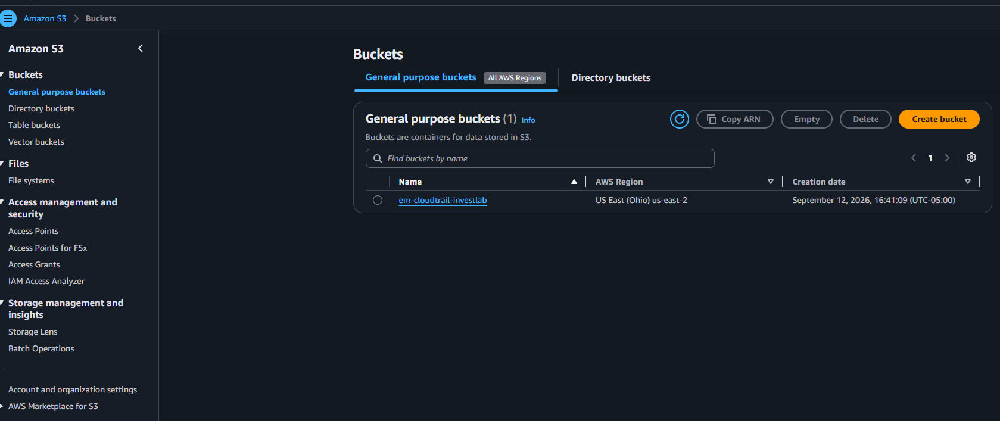
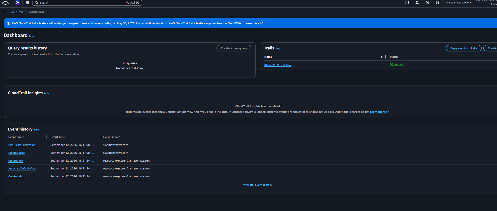
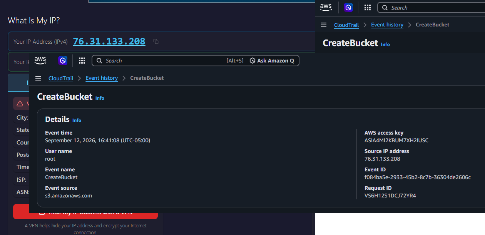
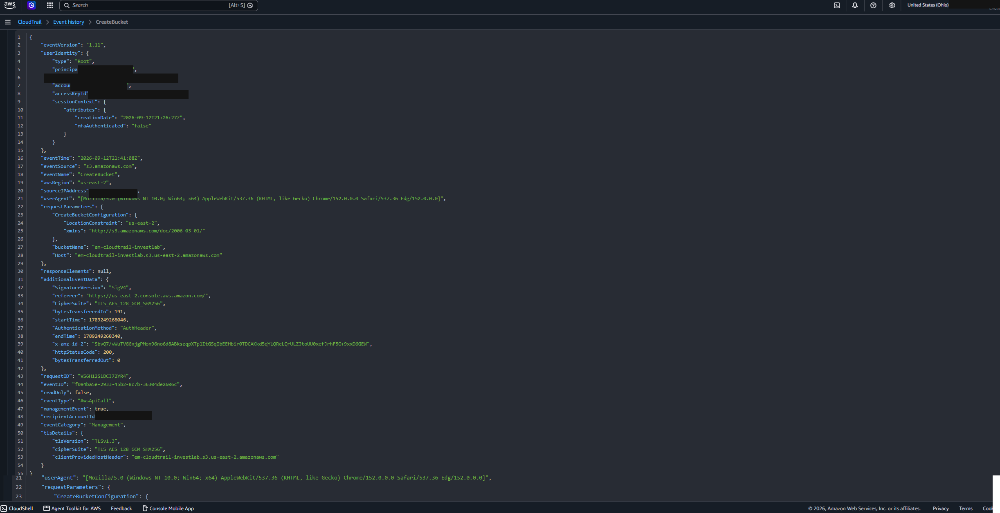

# AWS CloudTrail Investigation Lab

A hands-on exercise investigating an AWS resource change (S3 bucket creation) using CloudTrail Event History — simulating the first steps of a cloud security incident investigation.

**Author:** Evelio Morales Jr. — Security Engineer 1
**Portfolio:** [ev-portfolio.com](https://www.portfolio-ev.com)
**LinkedIn:** [linkedin.com/in/evelio-morales-jr101](https://linkedin.com/in/evelio-morales-jr101)

## Objective

Practice the core workflow of investigating a cloud change: create a resource, locate the corresponding CloudTrail event, and extract the identity, timing, and network details needed to answer "who did this, from where, and when?"

## Environment

- **Estimated time:** 20 minutes
- **Estimated cost:** $0 (empty S3 bucket + CloudTrail Event History only — no trail, event data store, or CloudTrail Lake configuration)
- **Region:** US East (Ohio) — `us-east-2`

## Steps Performed

### 1. Open S3 and create the bucket

Started from the Amazon S3 console and created a new bucket with a unique name (`em-cloudtrail-investlab`), leaving **Block all public access** enabled.

The bucket appears in the S3 console immediately after creation:

### 2. Wait for event delivery, then check CloudTrail

After a few minutes, opened CloudTrail → Event history and confirmed the `CreateBucket` event (along with a `PutBucketEncryption` event applied right after) appeared in the dashboard.

### 3. Filter by event name and open the event

Filtered Event history by Event name → `CreateBucket` and opened the event summary to review `userIdentity`, `eventTime`, `sourceIPAddress`, and `eventSource`.

### 4. Inspect the raw event

Opened the full JSON record to review `requestParameters` and confirm all details end to end.

### 5. Verify and clean up

Cross-checked the identity, source IP, timestamp, and action against my own activity to confirm it was expected, then emptied and deleted the bucket and located the resulting `DeleteBucket` event.

See [`findings.md`](./findings.md) for the extracted event details and analysis, and [`interview-notes.md`](./interview-notes.md) for the related interview-style Q&A.

## Key Takeaway

CloudTrail Event History is regional, covers **management events** only (not S3 object-level data events), and typically has a short delivery delay. When a change "disappears," the most common causes are wrong Region, wrong account, an active filter, or delivery delay — not a missing event.

## Cleanup

The bucket was emptied and deleted after the lab, and the resulting `DeleteBucket` event was located in Event history to confirm the deletion was logged.
